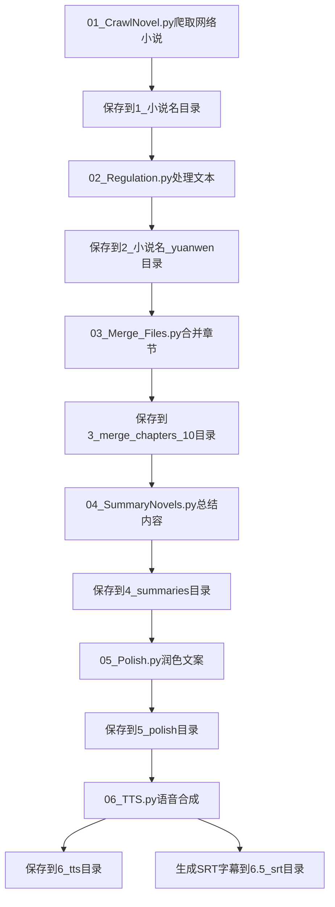

          
# 网络小说智能摘要系统

## 项目简介

本系统是基于Python实现的网络小说处理流水线，集成火山引擎Doubao大模型和微软TTS技术，提供从小说爬取、清洗、合并、摘要生成到语音合成的完整解决方案。

## 功能特点

- 🕷️ 自动化爬取笔趣阁等小说网站内容
- 🔄 多阶段文本处理流水线（清洗/合并/摘要/润色）
- 📚 支持自定义合并章节数（默认10章合并）
- 🤖 集成大模型摘要生成与文案润色
- 🔊 中文语音合成与字幕生成
- 📝 全流程执行日志记录

## 项目流程



## 文件结构

```
summary_novel/
├─ 1_小说名/              # 原始爬取文件
├─ 2_小说名_yuanwen/      # 清洗后文本
├─ 3_merge_chapters_10/   # 合并章节文件
├─ 4_summaries/           # AI生成摘要
├─ 5_polish/              # 润色文案
├─ 6_tts/                 # 语音文件(.mp3)
└─ 6.5_srt/               # 字幕文件(.srt)
```

## 详细使用说明

### 环境配置

1. 安装依赖库：

```bash
pip install -r requirements.txt
```

2. API密钥配置：
   在项目根目录创建 `.env`文件：

```ini
ARK_API_KEY=your_volcano_engine_key
```

### 分步操作指南

#### 1. 小说爬取

```bash
python 01_CrawlNovel.py
```
你需要修改的地方：
1. 小说的url
2. 小说的章节数 查看最后一章的url 的数字是多少
3. 小说的输出目录 output_dir 

#### 2. 文本清洗

```bash
python 02_Regulation.py --input_dir "1_perfect_world" 
```

**参数说明**：

- `--input_dir`: 原始文件目录 只需输入文件夹的名字


#### 3. 章节合并

```bash
python 03_Merge_FIles.py --chunk_size 15 --output_dir "3_merge_15chapters"
```

**参数说明**：

- `--chunk_size`: 合并章节数（默认10章）
- `--output_dir`: 合并文件输出目录

#### 4. 摘要生成

```bash
python 04_SummaryNovels.py --model "gb-7b-002" --temperature 0.3
```

**参数说明**：

- `--model`: 大模型版本（可选gb-7b-002/gb-7b-001）
- `--temperature`: 生成随机度（0.1~1.0）

#### 5. 文案润色

```bash
python 05_Polish.py --style "storytelling"
```

**支持润色风格**：

- `storytelling`（说书人风格，自动添加"上回说到"等衔接词）
- `academic`（学术报告风格）
- `brief`（极简风格）

#### 6. 语音合成

```bash
python 06_TTS.py --voice "zh-CN-YunxiNeural" --rate "+10%"
```

**参数说明**：

- `--voice`: 语音角色（推荐zh-CN-YunxiNeural男声/YunxiaNeural女声）
- `--rate`: 语速调节（-50%~+100%）

## 高级配置

### 自定义Prompt模板

1. 在项目根目录创建自定义模板文件
2. 修改 `04_SummaryNovels.py`中模板路径：

```python
prompt_content = read_file_content("prompt_good.txt")
```

### 批量处理配置

可以通过修改脚本中的参数实现批量处理：

```python
# 使用线程池批量处理(每次5个)
from concurrent.futures import ThreadPoolExecutor
BATCH_SIZE = 5

with ThreadPoolExecutor(max_workers=BATCH_SIZE) as executor:
    # 处理逻辑
```

## 注意事项

1. **编码处理**：

   - 使用 `chardet`检测文件编码
   - 转换命令示例：

   ```bash
   iconv -f GBK -t UTF-8 input.txt > output.txt
   ```

2. **性能优化**：

   - 单次API请求不超过10万字（火山引擎限制）
   - 启用多线程加速：

   ```python
   ThreadPoolExecutor(max_workers=5)
   ```

3. **故障排查**：

   - 查看 `error_logs`目录中的日志文件
   - 常见错误码：

   ```text
   1001 - API密钥无效
   2003 - 输入文本超过长度限制
   3007 - TTS语音合成超时
   ```

## 依赖项

```text
volcenginesdkarkruntime>=0.2.5
python-dotenv>=0.19.2
beautifulsoup4>=4.9.3
tqdm>=4.62.3
pydub>=0.25.1
```

## 示例输出

**摘要生成**：

```text
第一章至第十章：
石昊在虚神界初露锋芒，突破极境引发天地异象。遭遇雨族追杀，凭借鲲鹏宝术化险为夷，意外获得青铜神书...
```

**语音合成**：

```text
生成文件：6_tts/chapter_1-10.mp3
时长：4分28秒 比特率：192kbps
```

## 工具脚本

项目还包含以下辅助工具脚本：

- `count_words.py`: 字数统计工具
- `keyword_search.py`: 多关键词搜索工具
- `tts_quick.py`: 快速语音合成工具
- `tts_doubao.py`: 火山引擎TTS接口

## 版本更新

### v1.0 (2024-03)

- 🚀 完成基础功能开发
- 📊 支持批量处理小说章节
- 🔊 实现TTS语音合成功能

### 待开发功能

- 让文案偏向小说解说风格，比如：书接上回、细节描述风格、标题生成
- 适配MacOS，适配Linux文件路径
- 优化TTS项目：提升语音质量
- 集成FFmpeg：视频生成与格式编码

        当前模型请求量过大，请求排队约 1 位，请稍候或切换至其他模型问答体验更流畅。
```
